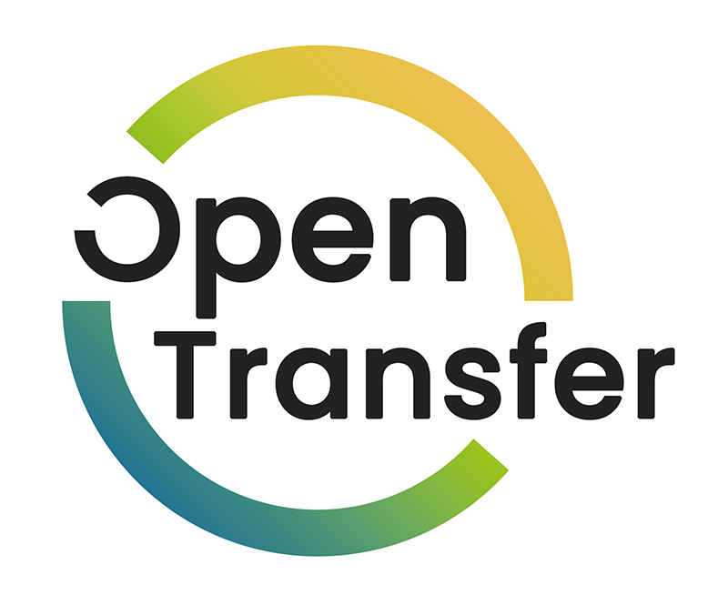

# Über das Projekt "OpenTransfer"

**Strategien für den Transfer von Forschungsergebnissen im Open-Science-Kontext**

Im Rahmen des Vorhabens OpenTransfer sollen neue Methoden für den besseren Transfer von Wissen und Technologien im Kontext von Open Science entwickelt und in Pilotvorhaben erprobt werden:

* Strategien und Geschäftsmodelle für den Transfer
* Werkzeuge für die konkrete und einfache Unterstützung von Transferprozessen
* Entwicklung und Einführung von Organisationsstrukturen und Prozessen für Open Transfer in den Forschungseinrichtungen

Der Transfer umfasst die Nutzung von Forschungsergebnissen außerhalb der Wissenschaft. Dabei kann es sich um kommerzielle Verwertung, vollständig kostenlose Verfügbarkeit oder hybride Ansätze handeln, bei denen je nach Zweck und Art der Nutzung unterschiedliche oder keine Gegenleistungen erforderlich sind.

##Open Science

"Open Science" bezieht sich auf einen Ansatz in der Wissenschaft, der auf Offenheit, Transparenz und Kollaboration setzt. Dabei werden wissenschaftliche Forschungsergebnisse, Daten, Methoden und andere Ressourcen frei zugänglich gemacht, um einen breiteren Austausch und eine verstärkte Zusammenarbeit zu ermöglichen. Open Science umfasst Prinzipien wie offenen Zugang zu wissenschaftlicher Literatur (Open Access), offene Daten, offene Forschungsprozesse, gemeinsame Nutzung von Ressourcen und die Einbeziehung der Öffentlichkeit in den wissenschaftlichen Diskurs. Das Ziel von Open Science ist es, die Reproduzierbarkeit, Qualität und Effektivität der Forschung zu verbessern und den Fortschritt in Wissenschaft und Gesellschaft zu fördern.

##Geschäftsmodelle

Im Kontext von "Open Science" gibt es verschiedene Geschäftsmodelle, die darauf abzielen, die Offenheit und den freien Zugang zu wissenschaftlichen Erkenntnissen zu unterstützen. Mögliche Geschäftsmodelle im Zusammenhang mit Open Science sind:

* Fördermittel und öffentliche Finanzierung: Forschungsprojekte im Bereich Open Science können durch Fördermittel von Regierungen, Stiftungen oder anderen Organisationen finanziert werden, um die Entwicklung und Umsetzung von Open-Science-Praktiken zu unterstützen.
* Daten- und Dienstleistungsmodelle: Institutionen oder Forschungsgruppen können Daten oder spezifische Dienstleistungen im Zusammenhang mit Open Science anbieten und diese gegen Gebühren oder Abonnements zur Verfügung stellen.
* Crowdfunding: Forscherinnen und Forscher können finanzielle Unterstützung für ihre Arbeit über Crowdfunding-Plattformen sammeln, um die Umsetzung von Open-Science-Praktiken zu ermöglichen.

Diese Geschäftsmodelle sollen sicherstellen, dass die Vorteile von Open Science nachhaltig und langfristig finanziert werden können. Sie tragen dazu bei, die Zusammenarbeit, den Wissenstransfer und die Innovation in der Wissenschaft zu fördern.

##Sondierungsprojekt "SOS Transfer"

Das Sondierungsprojek "SOS Transfer" untersuchte von 2021 bis 2022 die möglichen Einflüsse von Open-Science-Strategien auf den Wissens- und Technologietransfer. Es wurden Lösungsansätze identifiziert und entwickelt, die einen erfolgreichen Wissens- und Technologietransfer unter den Rahmenbedingungen von Open Science ermöglichen.

<video width="100%" height="100%" controls>
  <source src="videos/OpenTransfer.mp4" type="video/mp4">
  Your browser does not support the video tag.
</video>
