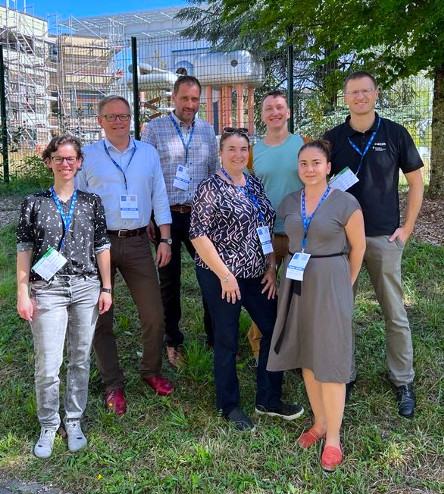

# Kontakt

<ttr-open@gsi.de>

**GSI Helmholtzzentrum für Schwerionenforschung**  
Dr. Tobias Engert 
Dr. Kathrin Göbel 
Albrecht Haag 

**Leibniz-IPHT – Leibniz-Institut für Photonische Technologien**  
Dr. Ivonne Bieber  
Dr. Thomas Jahn  
Dr. Andreas Wolff  

**HZDR – Helmholtz-Zentrum Dresden-Rossendorf**  
Dr. Björn Wolf   
Dr. Vladimir Voroshnin

